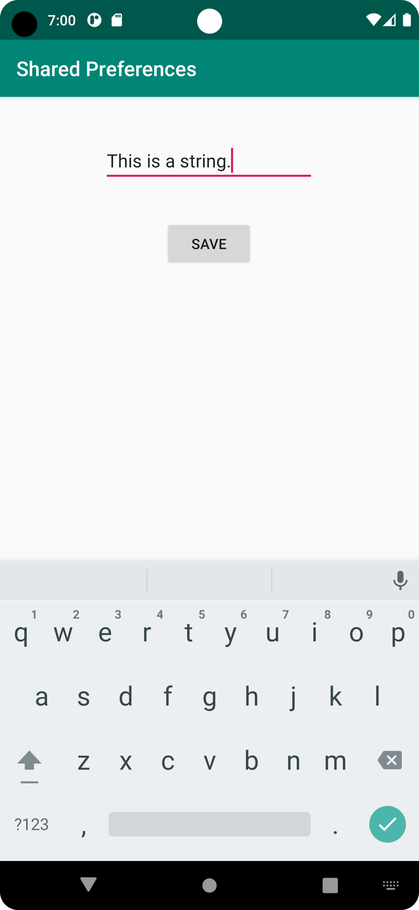
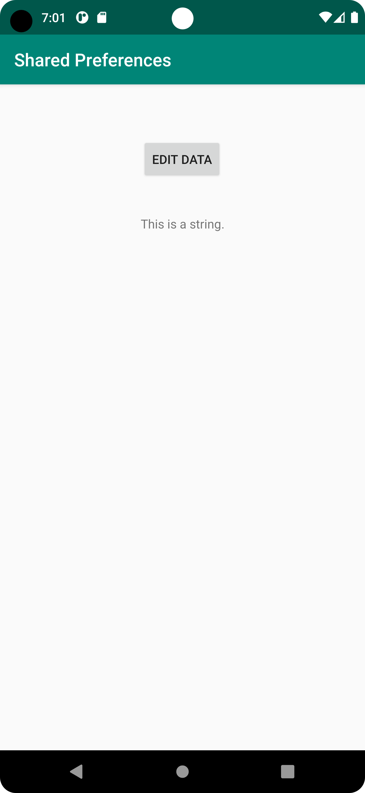

# Rapport

**Assignment 6: Shared preferences**

Jag påbörjade projektet genom att experimentera med shared preferences utifrån de instruktioner jag hittade på kurshemsidan.
Varpå jag förstått principen bakom lades shared preference variabler till som privata klassvariabler:
```
private SharedPreferences myPreferenceRef;
private SharedPreferences.Editor myPreferenceEditor;
```
Därefter skapades secondactivity. Dess layout-fil modifierads sedan till att inkludera en editText för att kunna mata 
in data, samt en knapp för att spara den data man matat in.
För att spara data skapades en onclickListener på knappen genom följande kod:
```
saveButton.setOnClickListener(new View.OnClickListener() {
    @Override
    public void onClick(View v) {
        myPreferenceEditor.putString("MyPersistentData", editText.getText().toString());
        myPreferenceEditor.apply();
        finish();
    }
});
```
Inuti listenern sparas den inmatade texten som en shared preference i nyckeln MyPersistentData. 
Därefter kommer man tillbaka till MainActivity genom finish. Jag använder finish() istället för att skapa en ny intent
delvis för att det är smidigare, men främst för att man inte lägger till fler activities än nödvändigt i "activity back stack".

Till sist läses den sparade datan ifrån MainActivity genom följande kod:
```
private void updatePreferenceText() {
    TextView preferenceView = findViewById(R.id.preferenceText);
    preferenceView.setText(myPreferenceRef.getString("MyPersistentData", "No preference found."));
    myPreferenceEditor.apply();
    System.out.println("persistent data: " + myPreferenceRef.getString("MyPersistentData", "No preference found."));
}
```

Det främsta problemet jag stötte på under utförandet av denna uppfift var att den data som matades in
i SecondActivity inte visades i MainActivity. Problemet var att jag använt mig av funktionen getPreference() istället
för getSharedPreference. Detta var ett problem eftersom getSharedPreference hämtar data oberoende av Activity, medan getPreference
låses till den Activity som data sparas.

_Resultatet blev följande:_.

